# XAMPRO – Examination Management System

A comprehensive full-stack Examination Management System designed for autonomous colleges to digitize and automate the complete examination lifecycle.

---

> [!NOTE]
>
> This repository is a **public demonstration** of **XAMPRO**. It showcases the system architecture, technology stack, user interface, and selected implementation to demonstrate the project's design and development approach.
>
> The complete production version contains additional modules, advanced business logic, institution-specific configurations, security implementations, and other proprietary components that are intentionally excluded from this repository.
>
> The institution name, branding, academic information, logos, and sample data used throughout this demonstration are included solely for showcasing the application's functionality and user interface. They do **not** represent an official deployment, endorsement, partnership, or affiliation with any educational institution. All such information is used exclusively for demonstration and portfolio purposes.

---

# Overview

XAMPRO is a comprehensive Examination Management System developed to streamline and automate the complete examination process within autonomous higher education institutions.

The platform manages the entire examination lifecycle, from student registration and examination scheduling to hall ticket generation, seating arrangements, dummy numbering, valuation, mark entry, grade processing, result publication, and student services.

The system follows a modular architecture with secure role-based access control, RESTful APIs, and a scalable PostgreSQL database.

---

# Public Demonstration Scope

This repository demonstrates:

- Overall system architecture
- User interface design
- Project structure
- Core examination workflows
- Database design approach
- Technology stack
- Authentication flow
- REST API architecture
- Sample modules
- Development methodology

This repository intentionally excludes:

- Production business logic
- Institution-specific configurations
- Sensitive implementation details
- Complete backend services
- Production database
- Deployment configuration
- Security-related implementations
- Proprietary algorithms
- Advanced examination processing modules

---

# Tech Stack

| Layer | Technologies |
|--------|--------------|
| Frontend | React, TypeScript, Vite, Tailwind CSS, Radix UI, React Router |
| Backend | Node.js, Express.js, TypeScript |
| Database | PostgreSQL |
| Authentication | JWT, bcrypt |
| State Management | React Query |
| Forms | React Hook Form, Zod |
| Reports | jsPDF, html2canvas, JsBarcode |
| Charts | Recharts |
| Progressive Web App | Workbox |

---

# Architecture

```text
                  Browser (SPA)

             React Application

                    │

        Components → Services

                    │

          Repository Layer

                    │

            REST API Client

                    │

            Express REST API

                    │

 Controllers → Services → Repositories

                    │

 Authentication
 Authorization
 Rate Limiting
 Audit Logging

                    │

               PostgreSQL
```

---

# Project Structure

```text
apps/
├── client/
│   ├── api/
│   ├── components/
│   ├── config/
│   ├── hooks/
│   ├── pages/
│   ├── repositories/
│   ├── services/
│   └── utils/
│
└── api/
    ├── controllers/
    ├── database/
    ├── middleware/
    ├── routes/
    └── services/
```

---

# Screenshots

The following screenshots demonstrate the primary user interfaces available in the public demonstration of XAMPRO.

---

## Role Selection

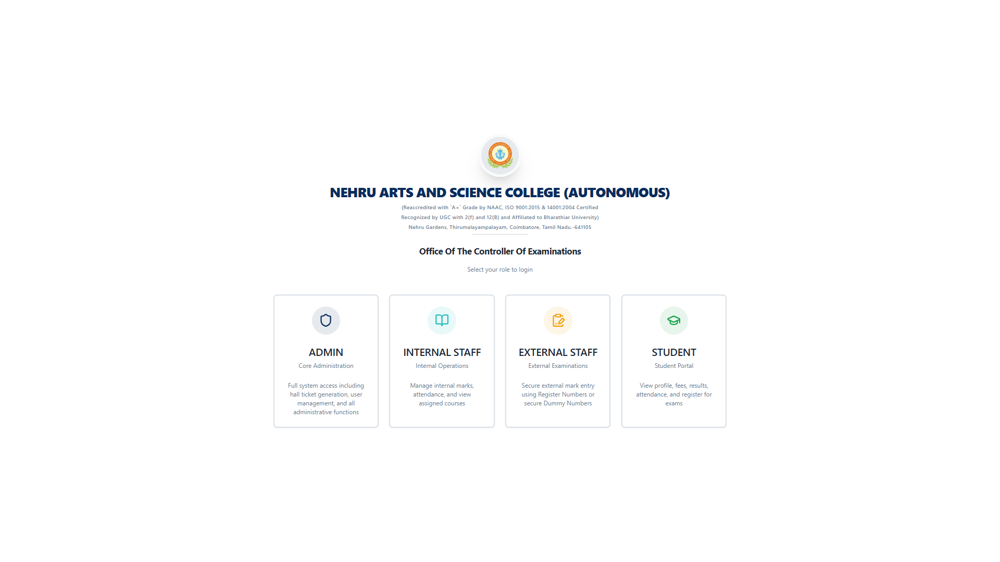

---

## Controller of Examination

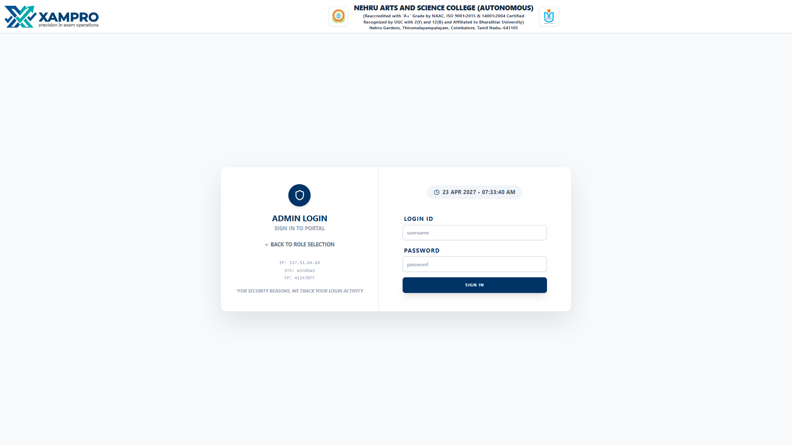

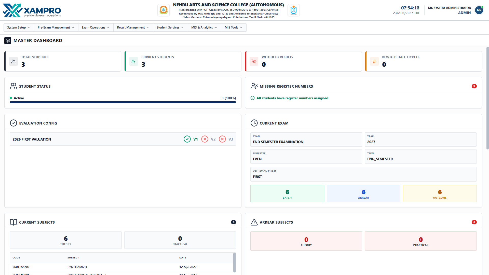

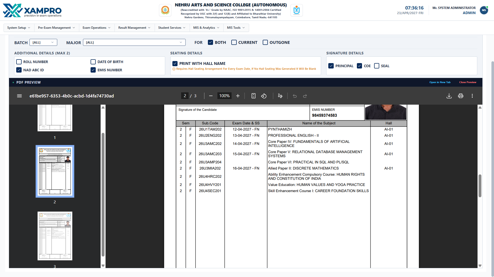

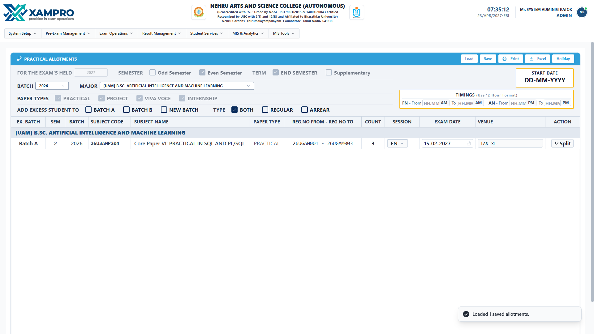

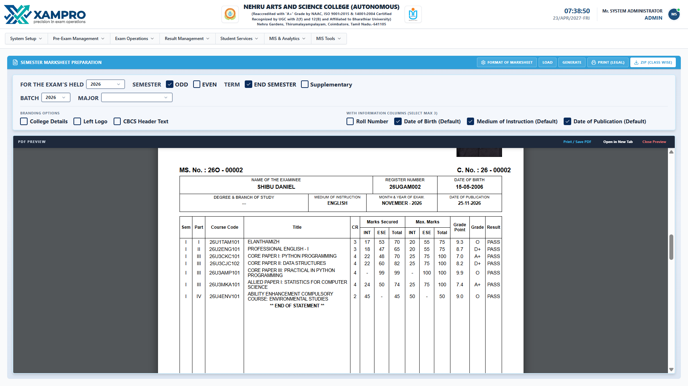

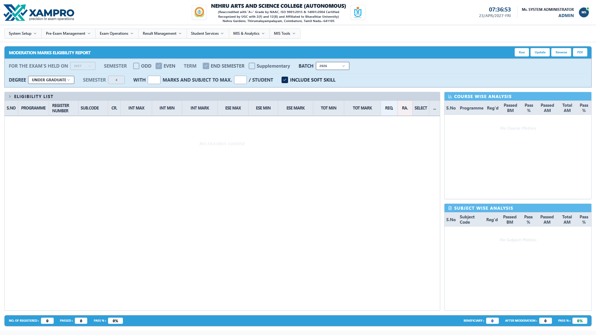

---

## Internal Staff

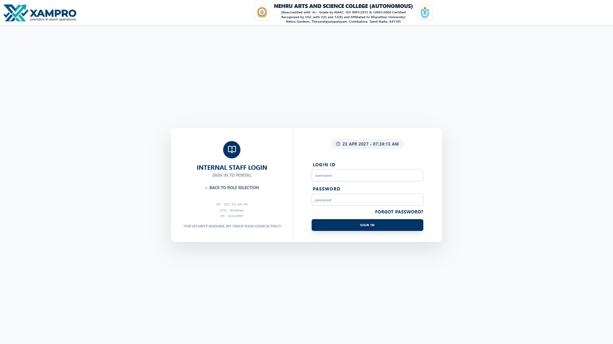

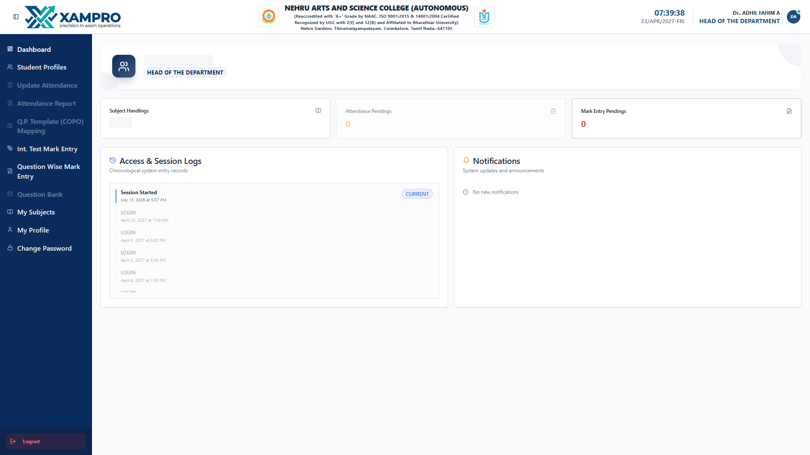

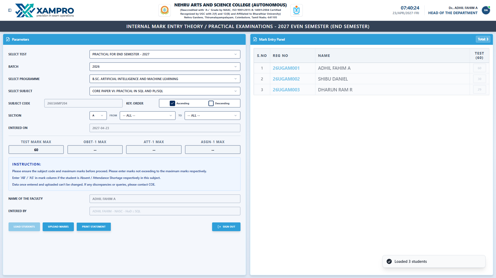

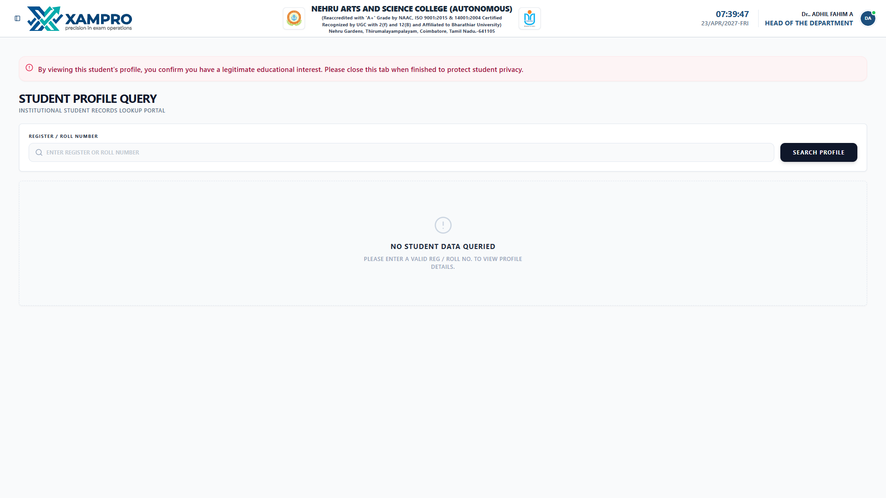

---

## External Examiners

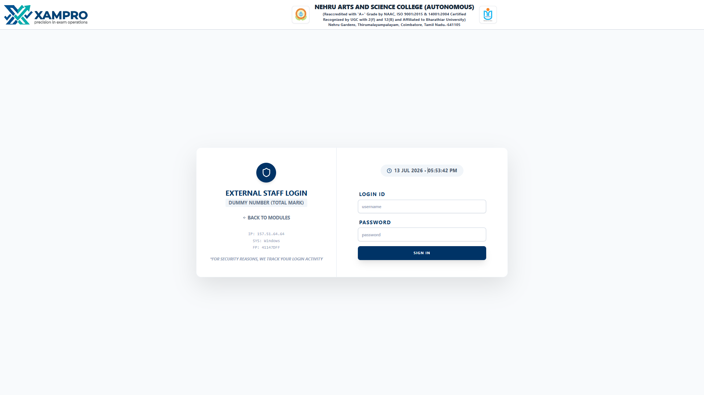

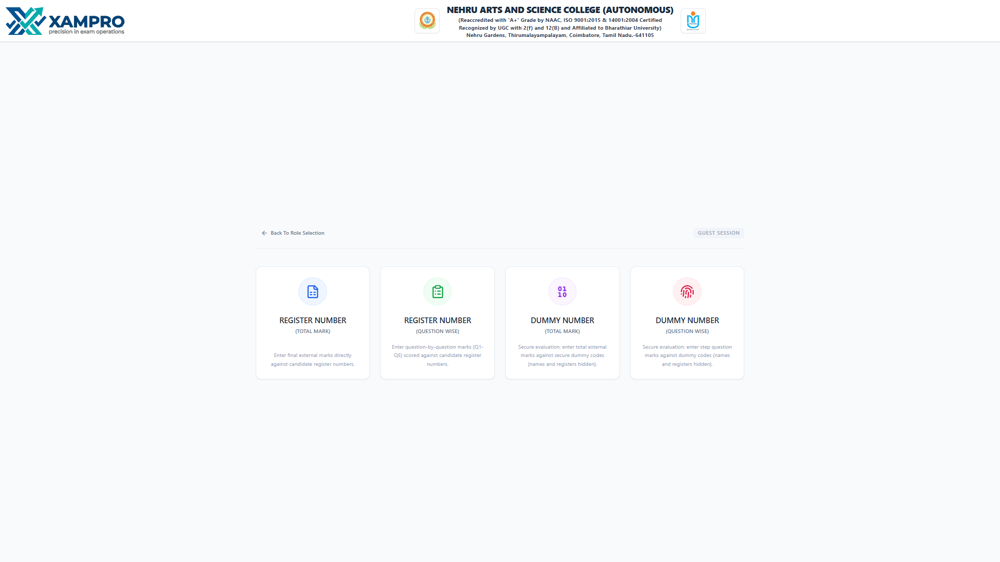

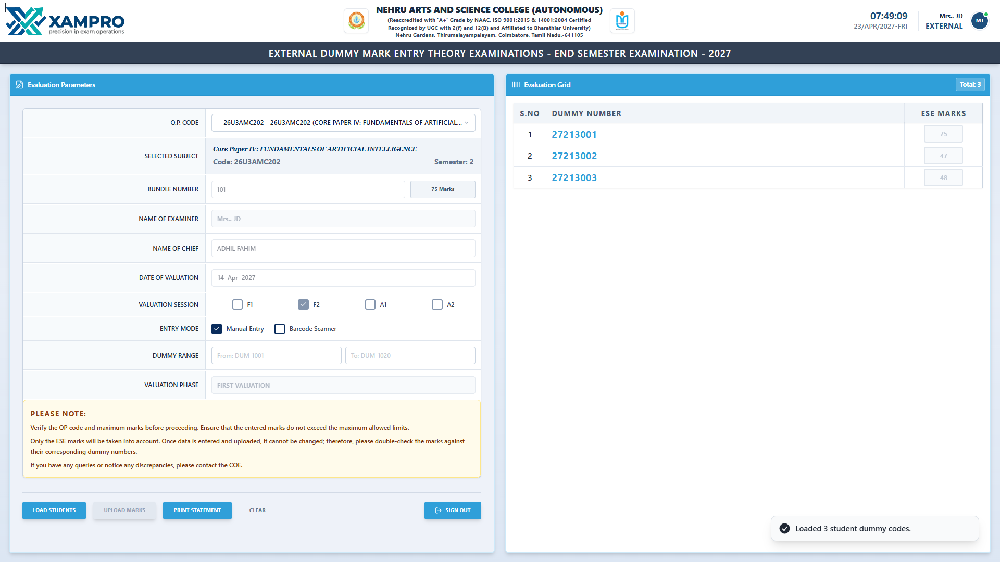

---

## Student Portal

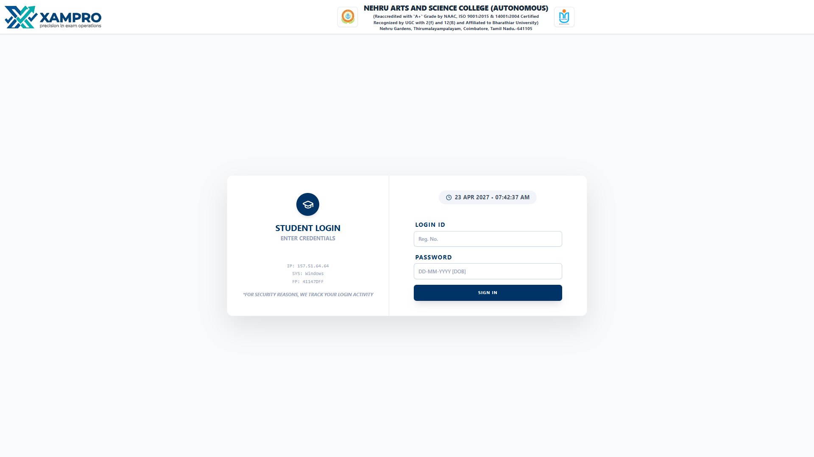

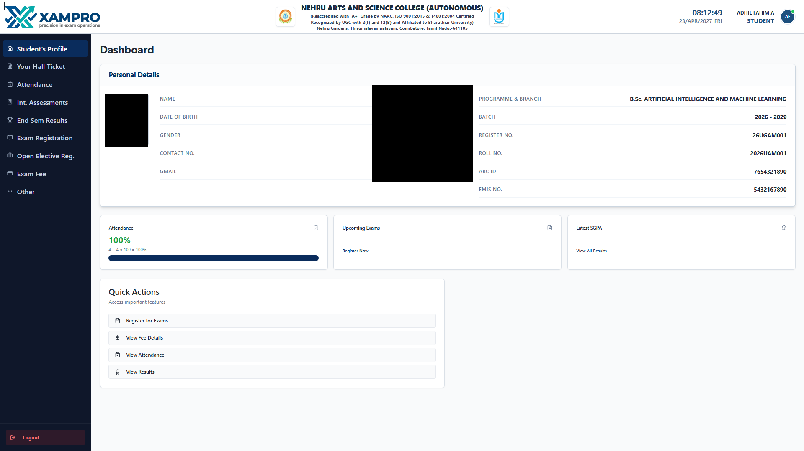

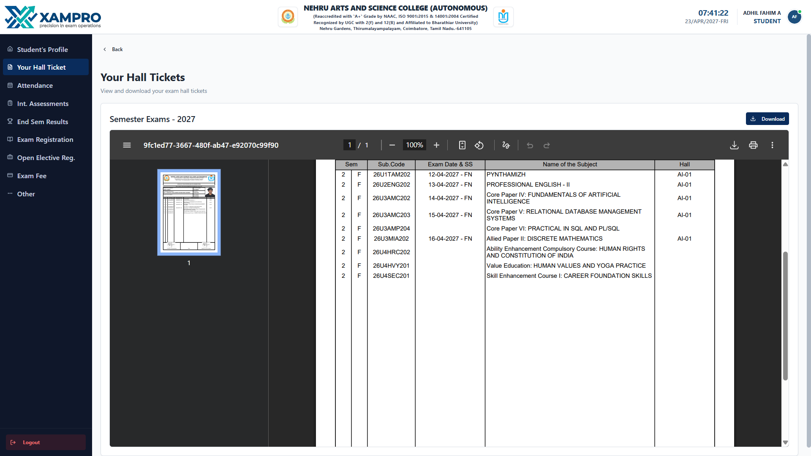

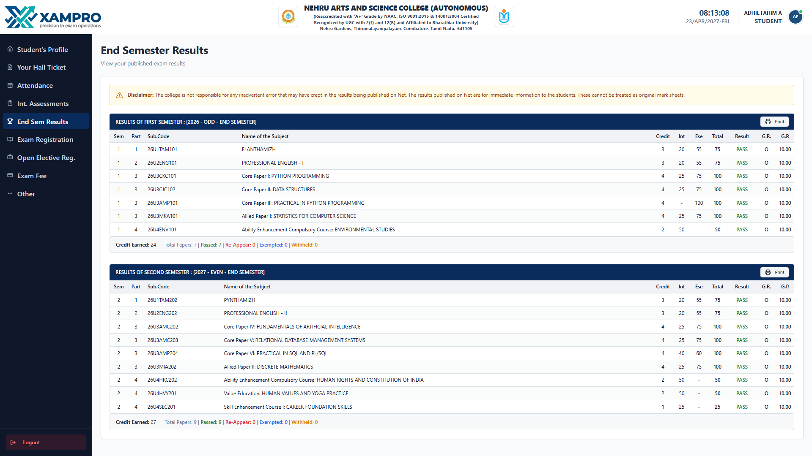

---

# Disclaimer

This repository is intended solely for portfolio and demonstration purposes.

The production version of XAMPRO includes additional modules, workflows, optimizations, institution-specific customizations, and proprietary implementations that are not included in this public repository.

---

# Author

**Adhil Fahim A**

GitHub: https://github.com/Adhil-fah
